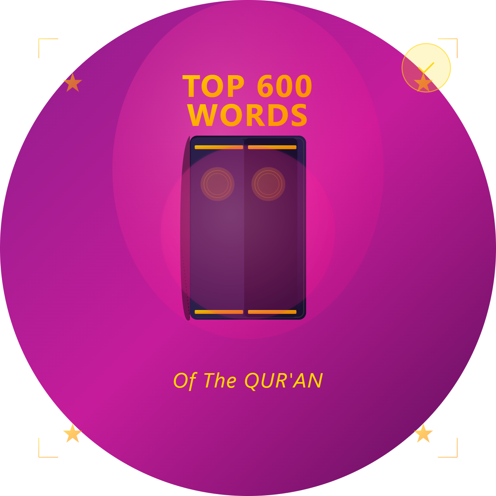

# Ma'na - Quran Word Frequency Study App

  
  
  **Master the most frequent words in the Holy Quran**
  
  
  
  

## 📖 About Ma'na

Ma'na (meaning "meaning" in Arabic) is an innovative Quran study application designed to help Muslims learn and master the most frequently used words in the Holy Quran. By focusing on high-frequency vocabulary, users can significantly improve their Quranic comprehension and understanding.

### 🎯 Key Features

#### 📚 **Word Frequency Learning**
- Study the most common words in the Quran ranked by frequency
- Each word includes Arabic text, pronunciation, English meaning, and Urdu translation
- Contextual verses showing how words are used in the Quran
- Track your learning progress with a comprehensive progress system

#### 🔊 **Multi-Language Text-to-Speech**
- Listen to Arabic pronunciations with proper Tajweed
- English and Urdu audio support for meanings
- Adjustable speech rate and pitch for comfortable learning
- Interactive audio controls for each word and verse

#### 🧠 **Interactive Quiz System**
- Test your knowledge with dynamic quizzes
- Questions generated from your learned vocabulary
- Multiple-choice format with instant feedback
- Track high scores and learning milestones
- Adaptive difficulty based on your progress

#### 🌐 **Multi-Language Support**
- **Arabic**: Original Quranic text with proper diacritics
- **English**: Clear, accurate translations
- **Urdu**: Native translations for Urdu speakers
- Pronunciation guides for non-Arabic speakers

#### ☁️ **Cloud Synchronization**
- Firebase integration for data backup
- Sync learning progress across devices
- Real-time updates and content management
- Offline capability with local data storage

#### 🎨 **Beautiful Islamic Design**
- Elegant Islamic-themed interface
- Quran-inspired background imagery
- Smooth animations and transitions
- Dark theme optimized for comfortable reading

#### 🔒 **Privacy & Security**
- Screen recording protection
- Data leakage prevention
- Secure user data handling
- Privacy-focused design

### 📱 Platform Support

- ✅ **Android** (API 21+)
- ✅ **iOS** (iOS 11+)
- ✅ **Web** (Progressive Web App)
- ✅ **Windows** (Desktop)
- ✅ **macOS** (Desktop)
- ✅ **Linux** (Desktop)

### 🛠️ Technical Features

#### **Built with Modern Technology**
- **Flutter Framework**: Cross-platform native performance
- **GetX State Management**: Reactive programming and dependency injection
- **Firebase Backend**: Real-time database and cloud functions
- **Local Storage**: Offline-first architecture with SharedPreferences
- **TTS Integration**: Native text-to-speech engines
- **Screen Protection**: Anti-screenshot and recording protection

#### **Architecture Highlights**
- Clean architecture with separation of concerns
- Reactive UI with real-time updates
- Efficient memory management
- Optimized for performance across all platforms
- Modular design for easy maintenance and updates

### 🎓 Learning Methodology

Ma'na follows a scientifically-backed approach to language learning:

1. **Frequency-Based Learning**: Focus on the most common words first
2. **Contextual Understanding**: Learn words within Quranic verses
3. **Multi-Sensory Approach**: Visual, auditory, and interactive learning
4. **Spaced Repetition**: Quiz system reinforces learned vocabulary
5. **Progress Tracking**: Monitor your journey and celebrate milestones

### 📊 App Statistics

- **5000+** Most frequent Quranic words
- **Multiple Languages** supported (Arabic, English, Urdu)
- **Cross-Platform** availability
- **Offline Capable** for uninterrupted learning
- **Cloud Sync** for seamless device switching

### 🚀 Getting Started

1. **Download** Ma'na from your preferred app store
2. **Launch** the app and complete the initial setup
3. **Start Learning** with the most frequent Quranic words
4. **Track Progress** as you master each word
5. **Take Quizzes** to test and reinforce your knowledge
6. **Sync Data** across all your devices

### 🎯 Target Audience

- **Students of Arabic** wanting to understand the Quran
- **Muslims** seeking to deepen their Quranic comprehension
- **Islamic Scholars** and teachers
- **Parents** teaching children Quranic vocabulary
- **Converts to Islam** learning Arabic through the Quran
- **Anyone** interested in Classical Arabic and Islamic studies

### 🌟 Why Choose Ma'na?

- **Scientifically Designed**: Based on frequency analysis of the entire Quran
- **Comprehensive**: Covers pronunciation, meaning, and context
- **Interactive**: Engaging quizzes and progress tracking
- **Accessible**: Multi-language support and audio features
- **Reliable**: Cloud backup and offline functionality
- **Beautiful**: Islamic-inspired design that enhances the learning experience

### 📞 Support & Community

For support, feedback, or feature requests, please contact us through the app or visit our community forums.

---

  
<strong>Start your journey to Quranic understanding today with Ma'na</strong>

  
<em>"And We have certainly made the Quran easy for remembrance, so is there any who will remember?" - Quran 54:17</em>

